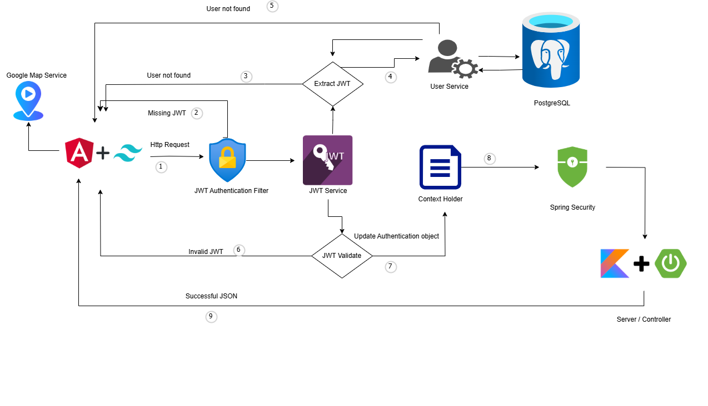
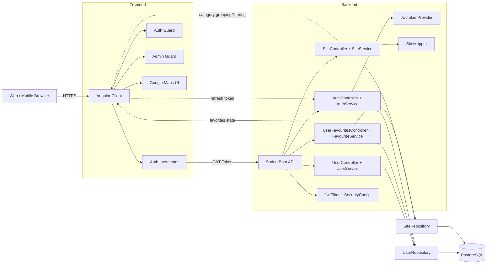

# Cultural Site Explorer

Production-ready documentation for the **Cultural Site Explorer** platform.

Cultural Site Explorer is a full-stack application for discovering and managing cultural locations (museums, theatres, restaurants, artwork points), with authenticated user journeys, favorites management, and map-based exploration.

## Table of Contents
- [Project Overview](#project-overview)
- [Key Capabilities](#key-capabilities)
- [Architecture](#architecture)
- [Technology Stack](#technology-stack)
- [Repository Structure](#repository-structure)
- [Getting Started](#getting-started)
- [Configuration](#configuration)
- [API Surface](#api-surface)
- [Security Model](#security-model)
- [Testing](#testing)
- [Operational Notes](#operational-notes)
- [License](#license)

## Project Overview
The repository contains two main applications:

- **Client**: Angular 18 application (with SSR scaffolding) for web UI, authentication flows, profile views, admin views, map visualization, and favorites.
- **Server**: Kotlin + Spring Boot REST API for authentication, user management, site catalog APIs, and favorites persistence in PostgreSQL.

## Key Capabilities
- JWT-based signup/login/refresh flows.
- Role-based access controls (USER/ADMIN) across API and client routes.
- Cultural sites listing, grouping, category filtering, and details.
- User favorites add/remove/list flows.
- Profile viewing and profile update journeys.
- Admin-only user listing and user deactivation.
- Map exploration through Google Maps integration.

## Architecture
High-level architecture diagram:




High-level architecture diagram (Mermaid):



## Component Relationships
- The Angular client sends all API traffic through an HTTP interceptor that injects JWT access tokens.
- Spring Security validates JWT on protected routes and exposes `/auth/**` publicly.
- Controllers delegate to services, which call repositories for PostgreSQL persistence.
- Site payloads are normalized by `SiteMapper` between DTOs and entity JSON fields.
- Favorites are modeled as a user-to-site relationship in the backend data model.


## Technology Stack

### Frontend (client)
- Angular 18 (standalone bootstrap + lazy-loaded feature modules)
- Angular Router, HttpClient, RxJS
- Angular Material + Tailwind CSS
- Google Maps JavaScript API (`@angular/google-maps`)

### Backend (server)
- Kotlin (JVM 17)
- Spring Boot 3 (Web, Security, Data JPA, Validation)
- PostgreSQL
- JJWT for token generation/validation
- Springdoc OpenAPI UI

## Repository Structure
```text
.
├── client/                     # Angular application
│   ├── src/app/core/           # Services, guards, interceptor
│   ├── src/app/features/       # Feature modules (auth, home, sites, map, profile, admin)
│   ├── src/app/shared/         # Shared UI components/layout/errors
│   └── public/                 # Static assets
├── server/                     # Kotlin Spring Boot API
│   ├── src/main/kotlin/
│   │   ├── config/             # Security/JWT/CORS/Swagger config
│   │   ├── controller/         # REST controllers
│   │   ├── service/            # Business logic
│   │   ├── repository/         # JPA repositories
│   │   ├── model/              # JPA entities
│   │   └── dto/                # Request/response DTOs + mappers
│   └── src/main/resources/     # application.yaml and logging config
└── docs/
    └── architecture.md         # High-level system diagram
```

## Getting Started

### Prerequisites
- Node.js 18+
- npm 9+
- Java 17+
- PostgreSQL 14+

### 1) Start PostgreSQL
Create database and credentials matching `server/src/main/resources/application.yaml`:

- Database: `cultural-explorer`
- Username: `postgres`
- Password: `password`
- Host: `localhost`
- Port: `5432`

### 2) Run backend API
```bash
cd /home/runner/work/cultural-site/cultural-site/server
./gradlew bootRun
```
API default base URL: `http://localhost:8080`

### 3) Run frontend
```bash
cd /home/runner/work/cultural-site/cultural-site/client
npm install
npm start
```
Web app default URL: `http://localhost:4200`

## Configuration

### Backend
Main config file:
- `/home/runner/work/cultural-site/cultural-site/server/src/main/resources/application.yaml`

Config groups:
- `spring.datasource.*`
- `spring.jpa.*`
- `jwt.*`
- `management.*`

### Frontend
API endpoints are currently hardcoded in services:
- `AuthService` → `http://localhost:8080/auth`
- `SiteService` → `http://localhost:8080/sites` and `/users/.../favourites`
- `UserService` → `http://localhost:8080/users`

For production, move these to environment-based configuration.

## API Surface

### Auth
- `POST /auth/signup`
- `POST /auth/login`
- `POST /auth/refresh`

### Sites
- `GET /sites`
- `GET /sites/grouped`
- `GET /sites/filter?category={CATEGORY}`
- `GET /sites/{id}`
- `GET /sites/type/{type}`
- `POST /sites` (ADMIN)
- `POST /sites/bulk` (ADMIN)
- `POST /sites/collection` (ADMIN)

### Users
- `GET /users` (ADMIN)
- `GET /users/{id}`
- `GET /users/status/{status}`
- `PUT /users/{id}`
- `PUT /users/{id}/deactivate`

### Favourites
- `POST /users/{userId}/favourites/{siteId}`
- `DELETE /users/{userId}/favourites/{siteId}`
- `GET /users/{userId}/favourites`

OpenAPI/Swagger UI:
- `http://localhost:8080/swagger-ui/index.html`

## Security Model
- Stateless JWT authorization enforced by Spring Security filter chain.
- `/auth/**` and Swagger endpoints are publicly accessible.
- All other backend endpoints require authentication.
- Method-level authorization (`@PreAuthorize`) is used for admin-only write operations.
- Client-side `AuthGuard` and `AdminGuard` protect restricted views.

## Testing

### Backend tests
```bash
cd /home/runner/work/cultural-site/cultural-site/server
./gradlew test
```

### Frontend tests
```bash
cd /home/runner/work/cultural-site/cultural-site/client
npm test
```

## Operational Notes
- Current frontend integrates Google Maps via script loader.
- For production hardening, externalize all secrets/keys and runtime URLs via environment variables.
- Use reverse proxy/API gateway + TLS termination for internet-facing deployments.

## License
MIT License (see [LICENSE](LICENSE)).
